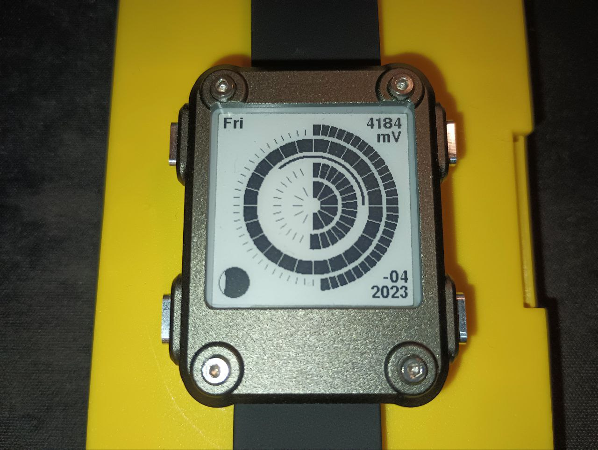

# watchy_orbital

Please compile with my fork https://github.com/Sudrien/Watchy 
unless sqfmi/Watchy#233 is merged

Tools >> Manage Libraries >> Add "Sunset" (tested with 1.1.7)

Arcs, from outside to inside, are Minutes, 24 hours, sunset/sunrise, day of month, month of year. 

Labels, clockwise, are battery voltage, timezone offset & year, moon phase, and day of week.

Sunrise & Sunset are dependent on LAT and LON in settings.h. these should be set even if wifi and NTP are not configured. 

